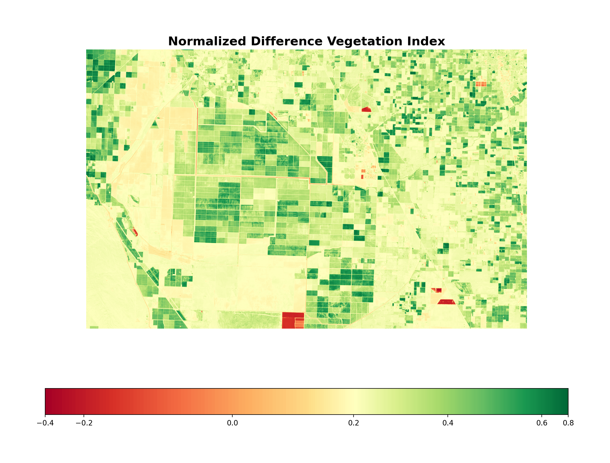

# NDVIUsingParallelism

Computes the Normalized Difference Vegetation Index (NDVI) for a Landsat 8 image by splitting its rows across MPI processes with mpi4py, computing each strip separately, and stitching the strips back together.

The code was written for a presentation, "Calculating NDVI Using Parallel Processing". The [slides](NDVI%20Presentation%20%281%29.pptx) and a serial notebook version of the same calculation are in the repository.



The figure is the notebook's output for the sample clip: about 63 km by 40 km of farmland in California's San Joaquin Valley, centred near 36.04° N, 119.65° W.

## NDVI

```
NDVI = (NIR - Red) / (NIR + Red)
```

For Landsat 8, Red is band 4 and near infrared (NIR) is band 5. The result lies between -1 and +1. Dense green vegetation scores high, bare ground scores near zero, and water is usually negative. For the sample clip the values run from -0.25 to 0.66.

## How `get_ndvi.py` works

1. Rank 0 reads the red and NIR bands with rasterio and converts them to `float64`.
2. Rank 0 cuts both arrays into one horizontal strip per process with `numpy.array_split`, keeps the first strip, and sends each of the others to its rank with `comm.Send`.
3. Every rank computes NDVI for its own strip with NumPy, writing 0 where `NIR + Red` is 0, and shows the strip in a Matplotlib window under the title `Processor ID: <rank>`.
4. The strips are reassembled along a chain. The last rank sends its result to the rank before it. Each rank in the middle appends what it receives below its own strip and passes the stack on. Rank 0 ends up with the full image.
5. Rank 0 displays the combined NDVI image and prints the elapsed time and the number of processes.

The timer starts right after the imports and stops after rank 0 has displayed the combined image, so the printed time covers reading the files, message passing and plotting as well as the NDVI arithmetic.

## Files

| Path | What it is |
| --- | --- |
| `get_ndvi.py` | The MPI script described above |
| `presentation_code/Calculating NDVI for our Area of Interest.ipynb` | Serial walkthrough: reads the two bands, computes NDVI, writes `ndvi.tif`, renders the colour-mapped figure above and a histogram of NDVI values |
| `presentation_code/Landsat8/` | Red (B4) and NIR (B5) clips of Landsat 8 scene `LC08_L1TP_042035_20180603_20180615_01_T1`: 2107 x 1338 pixels at 30 m, UTM zone 11N |
| `presentation_code/ndvi.tif`, `presentation_code/ndvi-image.png` | Outputs of the notebook |
| `NDVI Presentation (1).pptx` | The eight-slide deck. Its last slide is the timing chart discussed below |

## Running it

You need Python 3 with mpi4py, rasterio, NumPy and Matplotlib, and an MPI implementation that provides `mpiexec` (MPICH or Open MPI, for example). mpi4py does not bundle an MPI library; without one, `from mpi4py import MPI` fails.

```bash
git clone https://github.com/shubhroses/NDVIUsingParallelism.git
cd NDVIUsingParallelism
python3 -m venv .venv
source .venv/bin/activate
pip install mpi4py rasterio numpy matplotlib
```

If the machine has no MPI, `pip install mpich` puts the MPICH library and `mpiexec` into the virtual environment. That is how the check described below was set up.

Run the script from the repository root, because it opens the band files by relative path:

```bash
mpiexec -n 2 python get_ndvi.py
```

Each process opens a window showing its strip, and rank 0 then opens one with the combined image. With an interactive Matplotlib backend a window blocks its process until you close it, and that waiting time is included in the time printed at the end:

```
Time: <seconds> Number of Processors: 2
```

To run without windows, select the non-interactive Agg backend. Each process then prints a Matplotlib warning that the figure cannot be shown, and the script carries on:

```bash
MPLBACKEND=Agg mpiexec -n 2 python get_ndvi.py
```

Use 1, 2, 3 or 6 processes with the sample clip. See the limitations below for why.

The script was last checked in October 2026 on macOS (Apple silicon) with Python 3.13, mpi4py 4.1.2, MPICH 5.0.2, rasterio 1.5.2, NumPy 2.5.3 and Matplotlib 3.11.2, using the Agg backend. Runs with 1, 2, 3 and 6 processes produced the same 1338 x 2107 array, and that array equals the one the notebook computes.

To run the notebook, open it with `presentation_code/` as the working directory. It also needs a Jupyter kernel in the environment. It reads the band files from `Landsat8/` and writes `ndvi.tif` and `ndvi-image.png` next to itself. With the versions above it reproduces the tracked `ndvi.tif` byte for byte. The figure is rendered again, so `ndvi-image.png` changes.

## What the timing showed

The last slide of the deck plots run time against the number of processes, from 1 to 8. The axis has no unit; the script prints seconds. Read off the chart, a run took about 2.2 with one process, about 2.0 with three (the lowest point), and about 2.8 with eight.

In that chart, every process added beyond three made the whole run slower. The deck does not record which machine or which image was timed. Two things to keep in mind when reading it: the script's timer covers file reads, message passing and plotting as well as the NDVI arithmetic, and the clip the script is set up for is small, about 2.8 million pixels.

## Limitations

- **Sized for one image.** `image_height`, `width` and the two file paths are constants at the top of the script. The commented-out blocks above them hold the values for full Landsat 7, 8 and 9 scenes, which are not included in the repository.
- **Process count.** Each receiving rank allocates its buffer from a rounded-up strip height. That matches what `numpy.array_split` sends only when the image height divides evenly by the number of processes, which for the 1338-row sample means 1, 2, 3 or 6 among counts up to 8. Otherwise some buffers are one row taller than the strip they receive, the extra row is never written, and the script reassembles an image with too many rows without reporting it: 1339 rows with 4 or 5 processes and 1343 with 7 or 8, in place of 1338. The buffers come from `numpy.ndarray`, which does not initialise memory. In the check described above the extra rows came out as zeros. The timing chart in the deck includes those process counts.
- **Raw pixel values.** The band files hold Level-1 digital numbers as 16-bit integers. The script and the notebook apply the formula to them directly, with no conversion to reflectance.
- **Display only.** The script shows the result but does not write it to disk. The notebook does write a GeoTIFF.
- **Point-to-point messaging.** Strips are sent with blocking `Send` and `Recv` and gathered rank by rank, not with MPI's collective scatter and gather calls.

## Data and credits

- Landsat 8 imagery courtesy of the U.S. Geological Survey. The two band files are clips of the scene acquired on 3 June 2018 at path 42, row 35.
- The notebook is adapted from Parul Pandey's notebook of the same name in [parulnith/Satellite-Imagery-Analysis-with-Python](https://github.com/parulnith/Satellite-Imagery-Analysis-with-Python), which accompanies her article [Satellite Imagery Analysis with Python](https://medium.com/analytics-vidhya/satellite-imagery-analysis-with-python-3f8ccf8a7c32) (Analytics Vidhya, 24 November 2018). Its text cells and most of its code are unchanged from hers. The cells that load the data and compute NDVI were changed to read the two Landsat 8 band files, and three cells that print the image size, the reader type and the NIR values were added.
- Most of that code, comments included, matches line for line Planet Labs' earlier NDVI exercise, [`generate_ndvi_exercise_key.ipynb`](https://github.com/planetlabs/notebooks/blob/master/jupyter-notebooks/workflows/band_math_generate_ndvi/generate_ndvi_exercise_key.ipynb) in [planetlabs/notebooks](https://github.com/planetlabs/notebooks) (Apache License 2.0). Planet's notebook credits the `MidpointNormalize` class to Joe Kington.
- The background slides in the deck (2 to 4) are based on GIS Geography's article [What is NDVI (Normalized Difference Vegetation Index)?](https://gisgeography.com/ndvi-normalized-difference-vegetation-index/).
